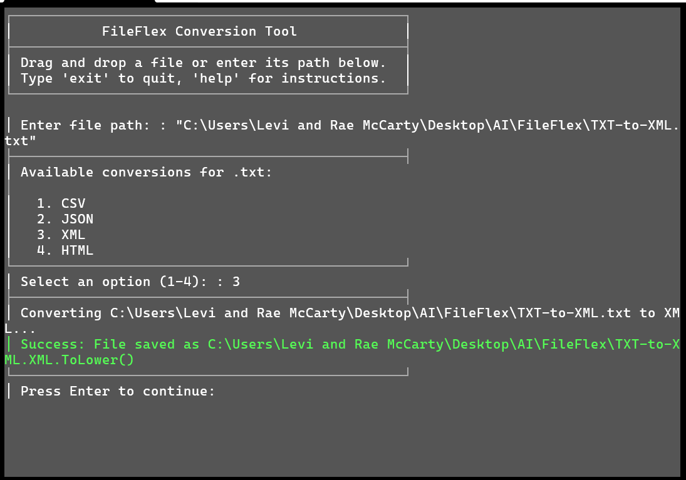

# FileFlex: What It Does
FileFlex is a tool that lets you convert files from one type to another, right from your PowerShell console. You drop a file in, pick what you want it to become, and it creates a new version of the file for you.

## How It Works
1. **Start It Up**: Run the script, and it shows a neat window asking for a file.
2. **Add a File**: Drag any file (like a `.txt`, `.pdf`, or `.jpg`) into the window or type its path.
3. **Pick a New Format**: It lists options for what you can turn your file into (e.g., a text file can become a CSV or JSON).
4. **Convert It**: Choose a number from the list, and FileFlex makes a new file in that format, saved next to the original.
5. **Check the Result**: It tells you if it worked or if something went wrong (like if a tool is missing).

## What It Can Handle
- **Text Files** (e.g., `.txt`): Turn them into CSV, JSON, XML, or HTML.
- **Spreadsheets** (e.g., `.csv`, `.xlsx`): Convert to JSON, XML, text, or Excel.
- **PDFs**: Extract text, make images (JPG/PNG), or turn into HTML or Word.
- **Images** (e.g., `.jpg`, `.png`): Switch between image types, make PDFs, or extract text.
- **Audio/Video** (e.g., `.mp3`, `.mp4`): Change audio formats, pull audio from video, or make GIFs.
- **And More**: Handles Word docs, HTML, and other common file types with various options.

## Simple Example
- You drop `notes.txt` into FileFlex.
- It offers: 1. CSV, 2. JSON, 3. XML, 4. HTML.
- You pick "2" (JSON), and it creates `notes.json` next to `notes.txt`.

## Why It’s Useful
- Keeps your original file safe while making a new one.
- Works with lots of file types businesses use.
- Looks professional and tells you what’s happening.
